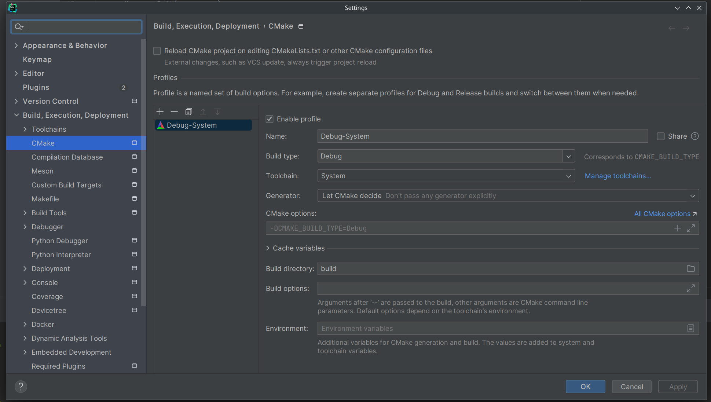

# Parsing PE Headers

## PE Structure

Every header shown is a data structure that holds information about the PE file.

### Relative Virtual Addresses (RVAs)

Relative Virtual Addresses are addresses used to reference locations within a PE file. For example, specifying the location of code, data, and resources.

_<mark style="color:red;">**IMPORTANT:**</mark>_ An RVA is a 32-bit value that specifies the **offset** of a data structure or section from the beginning of the PE file. Hence relative because it specifies the offset from the beginning of the file, rather than an absolute memory address.

The PE header contains several RVAs that specify the location of the code and data sections, the _**import**_ and _**export**_ tables, and other important data structures.

### DOS Header (IMAGE\_DOS\_HEADER)

The DOS header is located at the beginning of the PE file and contains information about the file, such as its size, and characteristics. _**But most importantly, it contains the RVA (offset) to the NT header.**_

_**NOTE:**_ Since the DOS header is at the very beginning of a PE file, retrieving the value is only a matter of getting a pointer. (pPE).

### NT Header (IMAGE\_NT\_HEADER)
